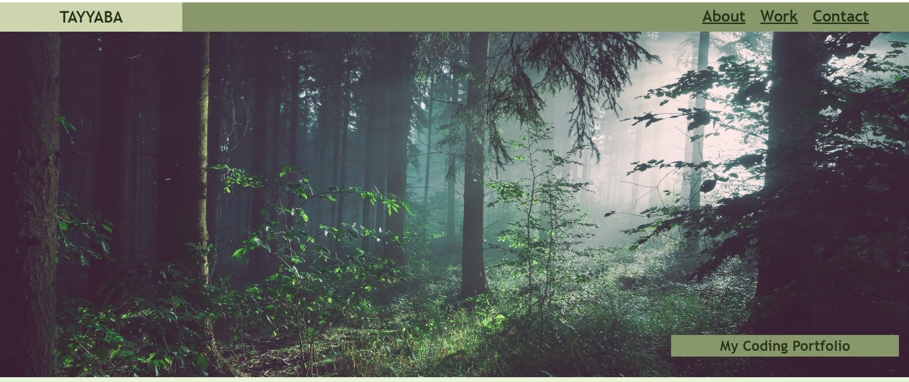

# Portfolio-Tayyaba Ifzal

## Description
This webpage is a portfolio of all my work related to front-end development. This page shows all the web development skills I encompass, as well as the projects I have worked in the past.

## Usage
The aim of this portfoilio is to showcase my skills to the recruiters in an organised way. This portfolio will also help in organising the projects I have worked and the skills sets used for the projects. Additionaly, this webpage allows potential recruiters and clients to contact me via phone, email or linkedin. They can also view my github profile to see my projects.

## features
Resposive Nav bar to allow easy access to all sections of the webpage.

Detailed about me page to get to know me better.
.png)

Work section include all my projects along with the coding skills and languages used.
.png)

A contact section with all the ontact information.
.png)

The website can also be viewed on mobile phone snd tablets. 

## Application Link
The website can ben assessed through following link:

https://tayyabaifzal.github.io/Portfolio-Tayyaba/

## Contact
https://github.com/tayyabaifzal

## License
MIT
